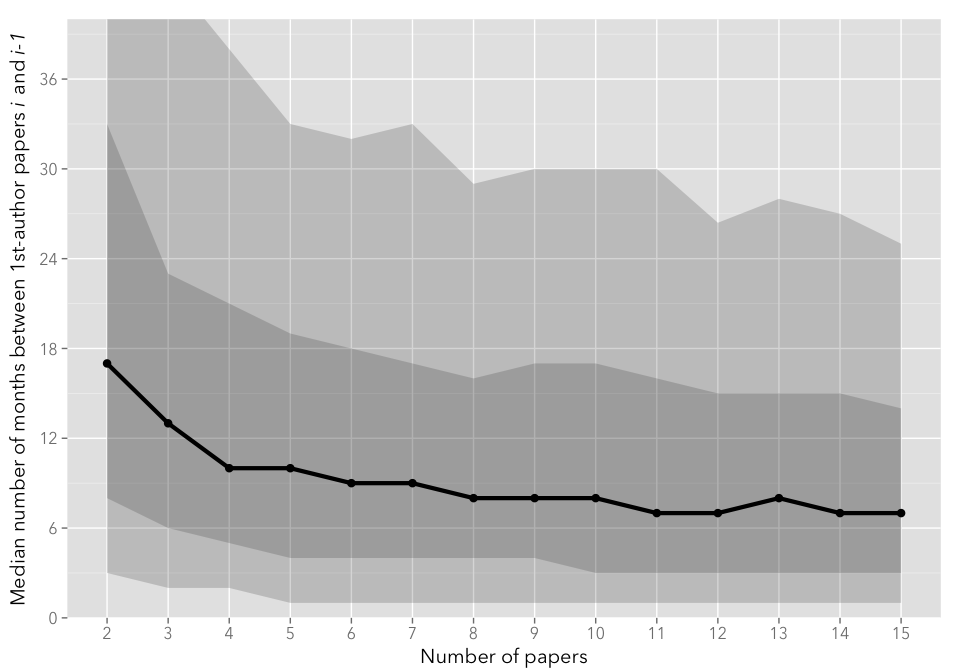
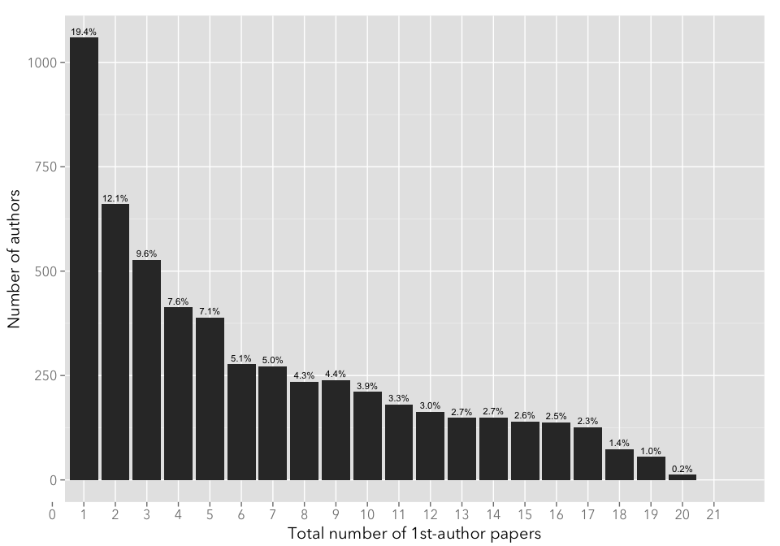
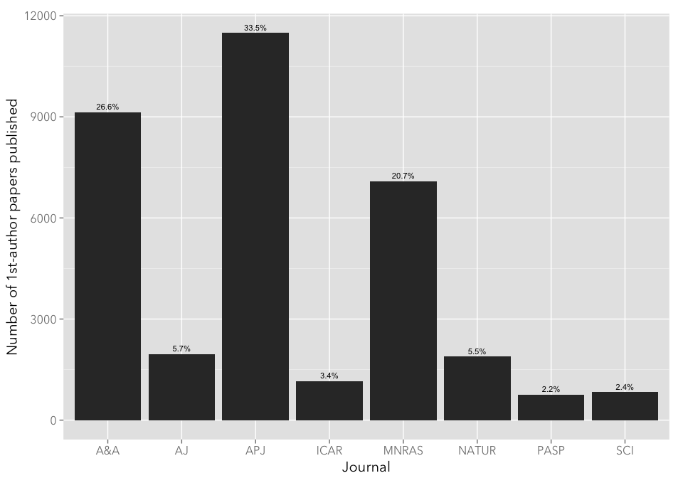
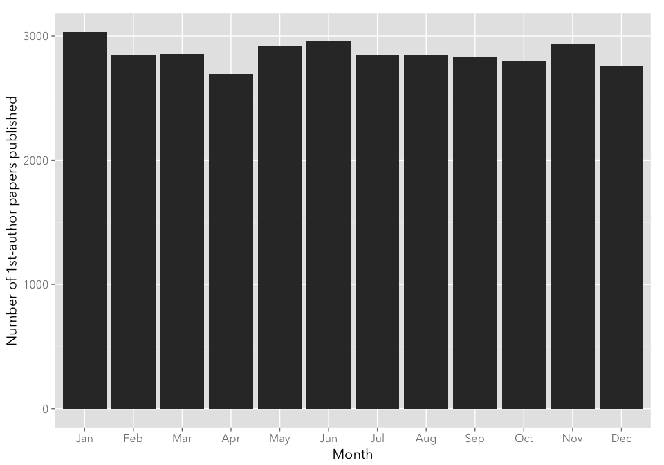

Intro
-----

I've been interested for a while in mining ADS (NASA's Astrophysics Data System, an online repository of bibliographic records). Using the [ADS developer API](https://github.com/adsabs/adsabs-dev-api), it is quite simple to download bibliographical records as JSON data and do some analysis on a sample of astronomical publications. (See [this post](http://www.stefanom.org/astrotrends-a-new-tool-to-track-astronomy-topics-in-the-literature/) and [this post](http://www.stefanom.org/astrotrends-no-so-weaselly-after-all/) to see some of the previous experiments I did on ADS data.)

The dataset I will create below will track the number of months between successive first-author papers (i.e. between the first and the second, the second and the third, etc.) to test the hypothesis that the rate of publishing papers increases as the author becomes more experienced and entrenched. This file (README.Rmd) contains all the analysis code used.

*Disclaimer: This data is for exploratory purposes only. No pretense of accuracy is implied!*

Results
-------

I downloaded ADS refereed bibliographical records for 10,813 author names in the form `"^Lastname, F."`. The data returned contains the first 40 rows (or fewer), sorted by date (oldest first). Only records from the following journals are retained: ApJ, MNRAS, A&A, AJ, PASP, Icarus, Nature, and Science. Only authors that published their first paper after 1960 are considered. See the next section for the full analysis and justification.

The file `data.csv` contains the fields `bibcode` (the journal where the paper was published), `year` and `month` (the publication date), `id` (a unique author identifier -- no actual names are used), `min_year` (the date of the first publication), `npap` (the ordinal number of the paper for that author id), and `diff` (the lag between successive papers, in months). The total number of authors that have more than one paper published in the journals listed above is whittled to 5,470.

### Time between papers

The following plot shows the median number of months between successive papers, with the 10-25-75-90th percentiles shown as a shaded area. The `quantiles.csv` contains pre-processed quantiles from the `data.csv` file.

``` r
quantiles <- read.csv('quantiles.csv')

ggplot(quantiles, aes(x=npap)) +
  geom_ribbon(aes(x=npap, ymin=q10, ymax=q90), alpha=0.2) + 
  geom_ribbon(aes(x=npap, ymin=q25, ymax=q75), alpha=0.2) + 
  geom_line(aes(x=npap, y=q50), size=1.5) +
  geom_point(aes(x=npap, y=q50), size=3) +
  ylab(latex2exp("Median number of months between 1st-author papers \\textit{i} and \\textit{i-1}")) +
  xlab("Number of papers") +
  scale_x_continuous(breaks=1:(max(quantiles$npap)+1)) +
  scale_y_continuous(breaks=seq(0, 100, by=6)) +  
  coord_cartesian(ylim=c(0, 40)) +
  theme(panel.grid.minor.x=element_blank())
```



On average, the lag between first-author papers decreases steadily from approximately a year and a half (**18 months**) between the first and the second paper, flattening to approximately **7-8 months** by the tenth paper published.

I only show up to the 15-th paper, as the number of authors that have more than 15 first-author papers published is comparatively small (see below).

### Number of papers published per author

The following plot shows the number of authors that have published exactly `N` first-author papers satisfying the criteria. The file `max_npap.csv` simply contains the `id` and `max_npap` columns.

``` r
max_npap <- read.csv("max_npap.csv")
ggplot(max_npap, aes(x=max_npap)) +
  geom_histogram(binwidth=1) +
  xlab("Total number of 1st-author papers") +
  ylab("Number of authors") +
  scale_x_discrete()
```



The rapid drop-off beyond 18 papers might be due to the fact that the total number of records is 40 (which include papers that are ultimately filtered out by the criteria above).

### Number of papers published per journal

The following plot shows the number of papers published, grouped by journal name (the usual suspects: ApJ, AJ, A&A, Icarus, MNRAS, Nature, and Science). As expected, ApJ, A&A, and MNRAS figure prominently.

``` r
intervals <- read.csv("data.csv")
ggplot(intervals, aes(x=bibcode)) +
  xlab("Journal") +
  ylab("Number of 1st-author papers published") +
  geom_histogram()
```



### Any summer/nice weather slump?

The following plot groups papers by month of publication. Seems pretty flat.

``` r
ggplot(intervals, aes(x=factor(month))) +
  xlab("Month") +
  ylab("Number of 1st-author papers published") +
  geom_histogram(binwidth=1) +
  scale_x_discrete(labels=month.abb)
```



Procedure
---------

The following R code was used to create the dataset.

I use the `stringr`, `dplyr`, and `plyr` packages to munge the data I download from ADS. The `rjson` package is used to convert JSON data into R objects.

``` r
library(stringr)
library(dplyr)
```

    ## 
    ## Attaching package: 'dplyr'
    ## 
    ## The following objects are masked from 'package:plyr':
    ## 
    ##     arrange, count, desc, failwith, id, mutate, rename, summarise,
    ##     summarize
    ## 
    ## The following objects are masked from 'package:stats':
    ## 
    ##     filter, lag
    ## 
    ## The following objects are masked from 'package:base':
    ## 
    ##     intersect, setdiff, setequal, union

``` r
library(memoise)
library(rjson)
library(latex2exp)
```

The following function is used to download data from the given URL. The `memoise` function is used to cache results. I use a 2-seconds throttle when downloading from ADS.

``` r
# Read URL content, with throttling and caching of the response
if (!file.exists('read_url.rds')) {
  read_url <- memoise(function(url, throttle=getOption('ads.throttle', 1)) {
    Sys.sleep(throttle)
    con <- url(url)
    on.exit(close(con))
    message(url)
    return(readLines(con, warn=FALSE))
  })
} else {
  read_url <- readRDS('read_url.rds')
}

read_urls <- function(urls) {
  return(sapply(urls, read_url))
}
```

My ADS dev key is stored as an environment variable (you can get one from ADS).

``` r
# Read ADS dev key
ads_key <- Sys.getenv("ADS_KEY")
```

This is the template URL used to query ADS. It retrieves up to 40 records of refereed 1st-author papers for the author.

``` r
# Get pubdates for the first 40 papers that are 1st author
ads_url <- str_c("http://adslabs.org/adsabs/api/search/?q=author:%22^@author.%22&sort=DATE+asc&fl=pubdate&max_rows=40&filter=property:refereed&dev_key=", ads_key)
```

These are the journals used. We excluded other journals since the ADS records for them don't always include the month (the month is set to 0). This is also the case for some of the older papers (e.g., [this paper](http://adsabs.harvard.edu/abs/1960MNRAS.121..525A)). In order to avoid including records with incomplete date information, I (a) exclude authors whose first paper is before 1960; and (b) remove authors that have *any* papers with the month field set to 0.

``` r
journals <- c('APJ', 'MNRAS', 'A&A', 'AJ', 'PASP', 'ICAR', 'NATUR', 'SCI')
minyear <- 1960
```

I start with a list of authors (in the form Lastname, F.) that I gathered from previous work on [AstroTRENDS](http://www.stefanom.org/playpen/Trends/keywords/). I remove some of the spurious authors that made their way in there.

``` r
# Read list of authors from authors.rds, as a character vector where each item is Lastname, F.
# authors.rds not included (for privacy reasons), but you can easily create your own.
data <- data_frame(author=unlist(readRDS("authors.rds"))) %>%
  mutate(id=row_number()) %>%
  filter(!(str_detect(author, 'Array') | str_detect(author, 'University') | str_detect(author, 'Collaboration') | str_detect(author, 'University'))) 
```

I then loop through the list of authors and download the JSON record from ADS; when the record is retrieved, I parse the bibcode, year and month and exclude any paper not in the "approved" list of journals.

``` r
# Loop through the list of authors
intervals <- ldply(data$author, function(a) {
  # Get the list of papers from the JSON returned by the ADS API
  url <- str_replace(ads_url, '@author', URLencode(a))
  text <- NULL
  tries <- 0
  error <- NULL

  text <- tryCatch(read_urls(url), error=function(e) { error <<- e; Sys.sleep(20); NULL })
  if (is.null(text)) {
    return(NULL)
  }
  docs <- fromJSON(text)$results$docs

  # Loop through the list of papers for the author
  ldply(docs, function(d) {
    # Extract the journal and year from the bibcode
    match <- str_match(d$bibcode, '([[:digit:]]{4})([[:alnum:]&]{1,5})')
    year <- as.numeric(match[2])
    journ <- str_to_upper(match[3])

    # Only include the paper if the journal is in the list of allowed journals
    if (journ %in% journals) {
      month <- as.numeric(str_match(d$pubdate, '[[:digit:]]{4}-([[:digit:]]{2})')[2])
      data_frame(author=a, bibcode=journ, year=year, month=month, months=year*12+month)
    }
  }, .id=NULL)
})
```

From the raw data downloaded, I set up a new `intervals` data frame that contains some derived data:

``` r
# Create "intervals" dataframe -- the diff column will contain the number of months elapsed
# between the (i+1)-th and the i-th npap.
intervals <- intervals %>%
  # Inner join with the authors dataframe in order to get the author IDs for cross-checking
  inner_join(data) %>%
  # Remove the name of the author for privacy reasons
  select(-author) %>%
  group_by(id) %>%
  # Create a npap column containing the paper index (1st, 2nd, etc.), and a
  # min_year column (the year of the first paper published)
  mutate(zero_month=any(month == 0), min_year=min(year), npap=row_number()) %>%
  # Remove any author that has a paper with a 0-month stamp, or with first paper published before
  # minyear
  filter(zero_month == FALSE & min_year > minyear) %>%
  # Compute differences between successive papers
  mutate(diff=c(NA, diff(months))) %>%
  ungroup() 

# Save the file as data.csv
write.csv(intervals, file="data.csv")
```

Since the `diff` column (the interval between the i-th and the (i-1)-th paper, in months) ends up being quite noisy -- as expected -- I derive median and 10%, 25%, 75% and 90% quantiles.

``` r
# Calculate quantiles
quantiles <- intervals
quantiles <- quantiles %>%
  # Only look at first 15 papers
  filter(npap <= 15 & npap > 1) %>%
  group_by(npap) %>%
  # Calculate quantiles
  summarise(q10 = quantile(diff, 0.1, na.rm=TRUE),
            q25 = quantile(diff, 0.25, na.rm=TRUE),
            q50 = quantile(diff, 0.5, na.rm=TRUE),
            avg = mean(diff, na.rm=TRUE),
            q75 = quantile(diff, 0.75, na.rm=TRUE),
            q90 = quantile(diff, 0.9, na.rm=TRUE)) %>%
  ungroup()
write.csv(quantiles, file="quantiles.csv")
```

Then, I compute the maximum number of papers for each author `id` to derive the number of papers histogram (see previous section.)

``` r
max_npap <- intervals
max_npap <- max_npap %>%
  group_by(id) %>%
  summarise(max_npap = max(npap))

write.csv(max_npap, file="max_npap.csv")
```

Finally, I save the memoised function to disk to cache the raw JSON data.

``` r
# Save response cache to disk upon exit
saveRDS(read_url, 'read_url.rds')
```

### Caveats

-   Authors that have the same initial are counted together. For instance, [Ford, E.](http://adsabs.harvard.edu/cgi-bin/nph-abs_connect?db_key=AST&db_key=PRE&qform=AST&arxiv_sel=astro-ph&arxiv_sel=cond-mat&arxiv_sel=cs&arxiv_sel=gr-qc&arxiv_sel=hep-ex&arxiv_sel=hep-lat&arxiv_sel=hep-ph&arxiv_sel=hep-th&arxiv_sel=math&arxiv_sel=math-ph&arxiv_sel=nlin&arxiv_sel=nucl-ex&arxiv_sel=nucl-th&arxiv_sel=physics&arxiv_sel=quant-ph&arxiv_sel=q-bio&sim_query=YES&ned_query=YES&adsobj_query=YES&aut_logic=OR&obj_logic=OR&author=Ford%2C+E.&object=&start_mon=&start_year=&end_mon=&end_year=&ttl_logic=OR&title=&txt_logic=OR&text=&nr_to_return=200&start_nr=1&jou_pick=ALL&ref_stems=&data_and=ALL&group_and=ALL&start_entry_day=&start_entry_mon=&start_entry_year=&end_entry_day=&end_entry_mon=&end_entry_year=&min_score=&sort=ODATE&data_type=SHORT&aut_syn=YES&ttl_syn=YES&txt_syn=YES&aut_wt=1.0&obj_wt=1.0&ttl_wt=0.3&txt_wt=3.0&aut_wgt=YES&obj_wgt=YES&ttl_wgt=YES&txt_wgt=YES&ttl_sco=YES&txt_sco=YES&version=1) matches at least two authors (Edward Ford and Eric B. Ford). Unfortunately, using, say, `^Ford, E. B.` as the author and forcing exact name matching on ADS means that we lose records where the author is recorded as `^Ford, E.`. There may be a better solution to avoid this.
-   Any other ideas? Suggestions on how to improve this analysis? File a bug or a pull request :)
